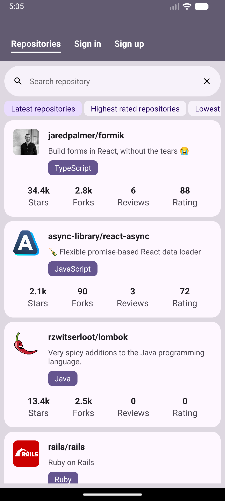
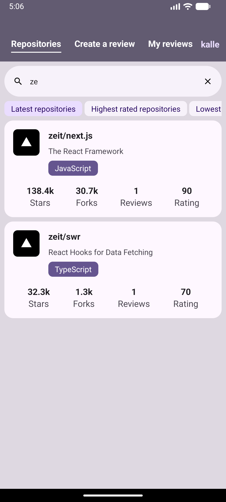
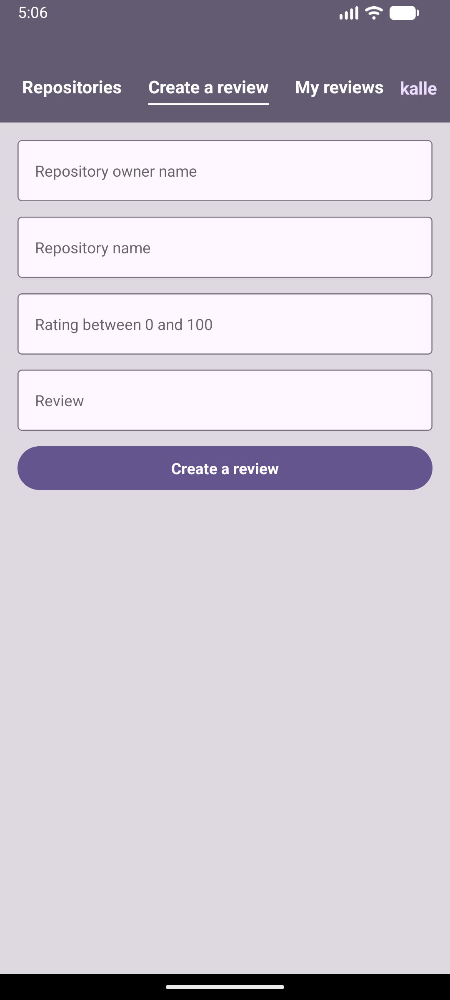
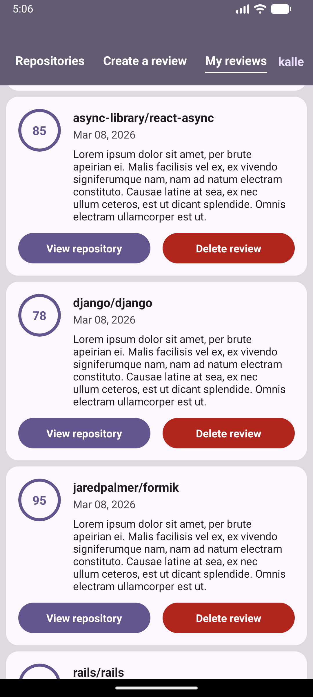

# Rate Repository Application
A mobile application for rating GitHub repositories, built as part of the *Full Stack Open* curriculum. This project remonstrates a deep dive into mobile development using React Native, Expo, and GraphQL.

Total spent time on the project:

[](https://wakatime.com/badge/user/86f132d3-54fc-4604-939b-ed564a36d178/project/36150526-f8cb-42d1-a605-784f622118e9)

---

## Features
- Browse Repositories
- Search & Filter
- User Authentication
- Reviews
- User Dashboard

## Tech Stack
- React Native with Expo
- Apollo Client (GraphQL)
- Formik & Yup
- React Router Native
- Jest & React Native Testing Library

## Screenshots

| Main Feed | Search | Create | Dashboard |
|---|---|---|---|
|  |  |  |  |

---

## Installation & Setup

### 1. Backend Requirements
This application requires the **Rate Repository API** to be running. 
* Clone the backend here: [rate-repository-api](https://github.com/moysush/rate-repository-api)
* Follow its internal instructions to start the GraphQL server (default: `http://localhost:4000`).

### 2. Frontend Setup
1.  **Clone the repository:**
    ```bash
    git clone <your-repo-link>
    cd rate-repository-app
    ```
2.  **Install dependencies:**
    ```bash
    npm install
    ```
3.  **Environment Configuration:**
    Create a `.env` file in the root directory and add your server address:
    ```env
    APOLLO_URI=http://<YOUR_LOCAL_IP_ADDRESS>:4000/graphql
    ```
    *(Note: Using your local IP is recommended for testing on physical devices or Expo Go.)*

4.  **Start the application:**
    ```bash
    npx expo start
    ```